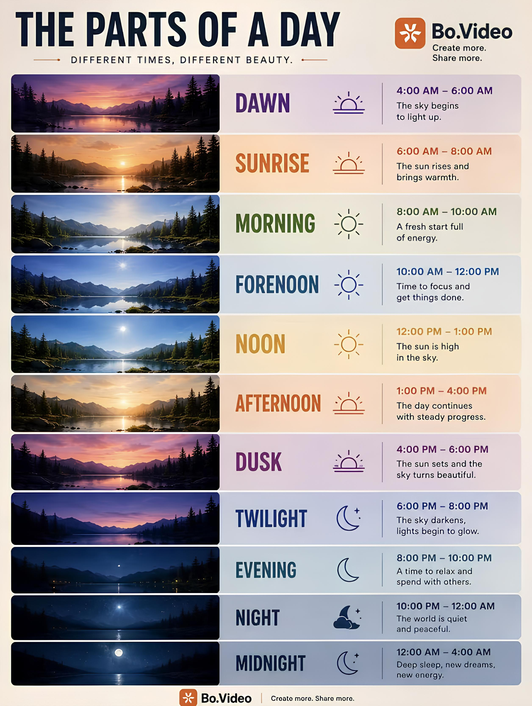

# Day Poems

A TypeScript library that divides the 24-hour day into 11 poetic time periods — each with a name, a description, and a classical Chinese poem (bilingual in Chinese and English).



## Installation

```bash
npm install day-poems
```

## Usage

```typescript
import { getCurrentTimePeriod } from 'day-poems';

// Get the current period (Chinese)
const period = getCurrentTimePeriod();
console.log(period.name); // e.g. "晨曦"
console.log(period.desc); // e.g. "旭日东升，暖意渐生。"
console.log(period.poem); // e.g. "日出江花红胜火，春来江水绿如蓝。"

// Get English version
const enPeriod = getCurrentTimePeriod('en');
console.log(enPeriod.name); // e.g. "SUNRISE"
```

## Time Periods

| Period | Time | Name | Poem |
|--------|------|------|------|
| Dawn | 04:00–06:00 | DAWN | 东方既白，晨光熹微。 |
| Sunrise | 06:00–08:00 | SUNRISE | 日出江花红胜火，春来江水绿如蓝。 |
| Morning | 08:00–10:00 | MORNING | 朝辞白帝彩云间，千里江陵一日还。 |
| Forenoon | 10:00–12:00 | FORENOON | 大鹏一日同风起，扶摇直上九万里。 |
| Noon | 12:00–13:00 | NOON | 亭午息群物，独游爱芳塘。 |
| Afternoon | 13:00–16:00 | AFTERNOON | 山重水复疑无路，柳暗花明又一村。 |
| Dusk | 16:00–18:00 | DUSK | 落霞与孤鹜齐飞，秋水共长天一色。 |
| Twilight | 18:00–20:00 | TWILIGHT | 月上柳梢头，人约黄昏后。 |
| Evening | 20:00–22:00 | EVENING | 开轩面场圃，把酒话桑麻。 |
| Night | 22:00–24:00 | NIGHT | 天阶夜色凉如水，坐看牵牛织女星。 |
| Midnight | 00:00–04:00 | MIDNIGHT | 姑苏城外寒山寺，夜半钟声到客船。 |

## API

### `getCurrentTimePeriod(lang?)`

- **lang** (optional): `'zh'` or `'en'`, defaults to `'zh'`
- **returns**: `TimePeriod` object

```typescript
interface TimePeriod {
  id: string;          // period identifier
  name: string;        // period name
  time: string;        // time range, e.g. "06:00 - 08:00"
  desc: string;        // period description
  poem: string;        // corresponding poem
  startHour: number;   // start hour
  endHour: number;     // end hour
  currentHour: number; // current hour
  timestamp: number;   // timestamp when called
}
```

## License

MIT
